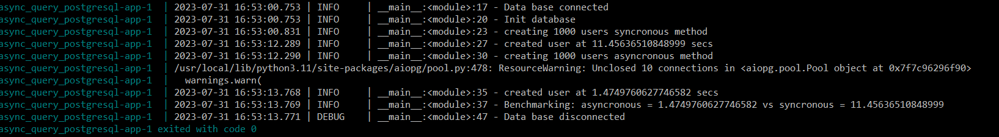

# async_query_postgresql
This example uses python libraries asyncio and aiopg and compare with syncronous queries into PostgreSql

## Stack
### Docker
* Docker compose file services:
    * app: Python program that does queries using two methods, syncronous and asyncronous, for compare executing time
    * db: Postgresql database
### Python libraries
* asyncio and aiopg for implement syncronous method
* get-docker-secret for access to containers secrets
* psycopg2 for connect to data base
* pytest for unit tests

### IDE
* vscode let developing into containers. You have setting file in /.devontainer/devcontainer.json

## Execute
1. You can create a virtual enviroment with requirements.txt and execute with python:
* tests
```python -m pytest```
* application
```python app.py```

2. If you have installed docker compose you can see benchmarking on de console using:
```docker-compose up```

Containers will delete with
```docker-compose down --rmi local```

